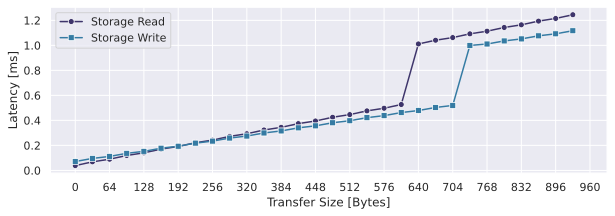
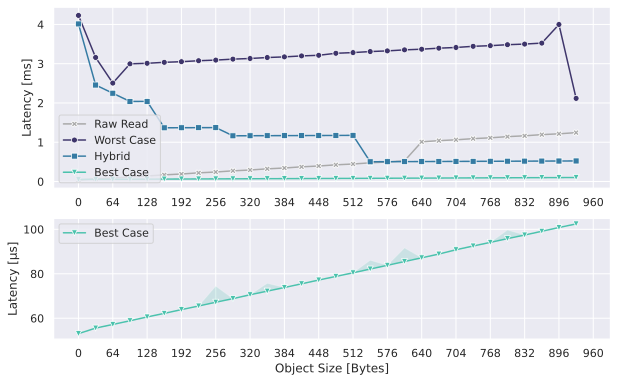
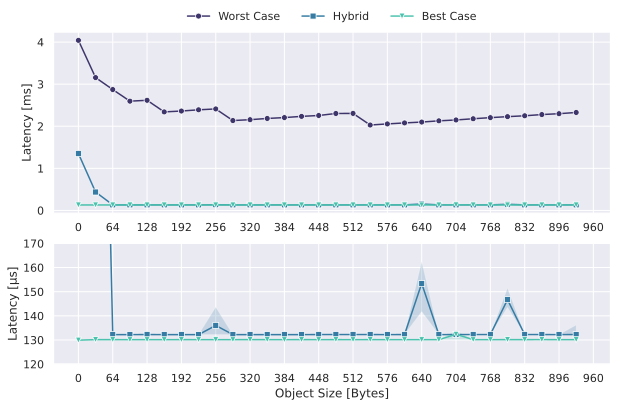
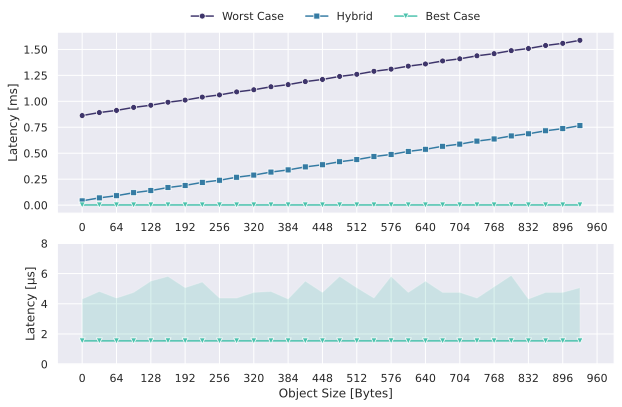

# Virtual Non-Volatile Heap (vNVHeap)

I (*Markus Gerber*) developed this heap as part of my bachelor thesis at the Chair of Computer Science 4 for Systemsoftware at the *Friedrich-Alexander University Erlangen-Nuremberg, Germany* (FAU).

The following should give you an overview of the thesis, its implementation and evaluation.

## Introduction

### Abstract

### Evaluation Hardware


## Usage

### Overview

To use the vNVHeap in an application follow these steps.

1. Add the vNVHeap library as a dependency in your application:

    ```toml
    vnv_heap = { path = "../vnv_heap", features = [] }
    ```

    Possible features are:

    - `benchmarks`: Enable benchmarking for this application. Look at [desktop_benchmark](desktop_benchmark/) or [zephyr/vnv_heap_benchmark](zephyr/vnv_heap_benchmark/) for examples.
    - `persist_debug_prints`: Enable safe debug prints during persisting. This feature uses the `write` system call and thus depends on `libc`, meaning it cannot be used in all environments.
    - `persist_debug_unsafe_prints`: **THIS FEATURE IS UNSAFE! USE IT WITH CAUTION!!!** Enables unsafe debug prints during persisting. This features uses the standard println! macro. This however can result in undesired behavior as its implementation is commonly not reentrant.

2. Define your own modules if needed:

    There already exist some implementations for the modules:

    - `AllocatorModule` (Defined a strategy to allocate data in a RAM buffer. Any kind of heap can be implemented for this.)
        - `BuddyAllocatorModule`
        - `LinkedListAllocatorModule`
    - `NonResidentAllocatorModule` (Defines a strategy to allocate data on a non-volatile external storage device. This has to be efficient due to high delay.)
        - `NonResidentBuddyAllocatorModule`
    - `ObjectManagementModule` (Defines which objects should be unloaded and persisted)
        - `DefaultObjectManagementModule`: This module is currently very basic
    - `PersistentStorageModule` (Defines an interface for reading and writing data to a storage device)
        - `FilePersistentStorageModule`: This is only enabled in environments that use `std`. (*This maybe should be fixed and added to a own feature as not all std environments support files*)

3. Start using vNVHeap with your own modules:

    ```rust
    fn main() {
        // initiate your storage module
        let storage = FilePersistentStorageModule::new("test.data".to_string(), 4096).unwrap();
        let config = VNVConfig {
            // specify how many bytes are able to be dirty
            max_dirty_bytes: 1024,
        };
        // initiate the buffer for resident objects and metadata
        let mut buffer = [0u8; 2048];
        // initiate the internal heap module that operates on the previously defined buffer
        let heap = LinkedListAllocatorModule::new();

        // initiate the heap and specify all modules
        let heap: vNVHeap<
            LinkedListAllocatorModule,
            NonResidentBuddyAllocatorModule<16>,
            DefaultObjectManagementModule,
            FilePersistentStorageModule
        > = vNVHeap::new(
            &mut buffer,
            storage,
            heap,
            config,
            // persist finished handler
            |_, _| {
                // called once state is fully persisted
                // system call shares this fact with the OS
                persist_finished();
            }
        ).unwrap();

        {
            // allocate new counter (the counter struct is defined below)
            let mut obj = heap.allocate::<Counter>(Counter::new(0)).unwrap();

            {
                // print current value
                let obj_ref = obj.get().unwrap();
                println!("counter: {}", obj_ref.get_val());
            } // implicit drop of immutable reference: object could be unloaded

            // do something in between...

            {
                // increase the value by 100
                let mut mut_ref = obj.get_mut().unwrap();
                mut_ref.increase();
                println!("counter: {}", mut_ref.get_val());
                mut_ref.increase_by(100);
            } // implicit drop of mutable reference: object could be synchronized/unloaded

            // do something in between...

            {
                // print current value
                let obj_ref = obj.get().unwrap();
                println!("counter: {}", obj_ref.get_val());
            } // implicit drop of immutable reference: object could be unloaded

        } // implicit drop of obj1: free memory
    }

    // should be called once power failure is imminent
    // persist the state of the initialized vNVHeap
    fn persist() {
        // unsafe: this should not be called if another
        // call of this function did not finish yet
        unsafe { vnv_persist_all() };
    }

    // define a sample counter struct
    struct Counter {
        val: u32
    }

    impl Counter {
        fn new(initial_value: u32) -> Self { Self { val: initial_value } }
        fn increase(&mut self) { self.val += 1; }
        fn increase_by(&mut self, inc: u32) { self.val += inc; }
        fn get_val(&self) -> u32 { self.val }
    }
    ```

    *This example is also available in the [counter_example](counter_example/) directory.*

### Further Examples

More examples for using vNVHeap can be found in different directories:

- [counter_example](counter_example/): Simple counter example.
- [desktop_persist](desktop_persist/): Example how to use the persist interrupt to persist vNVHeap. Run [desktop_persist/run_checked_output.sh](desktop_persist/run_checked_output.sh) to automatically persist the vNVHeap multiple times a second.
- [desktop_playground](desktop_playground/): Another simple usage example.
- [zephyr/vnv_heap_persist](zephyr/vnv_heap_persist/): A example that uses a button to trigger persists on an ESP32-C3 with a Fujitsu MB85RS64V FRAM module and Zephyr RTOS. Pin connections:
  - SCK: Pin 6
  - MISO: Pin 2
  - MOSI: Pin 7
  - CS: Pin 1
  - Button: Connect with GRND and Pin 0
- [zephyr/vnv_heap_sample](zephyr/vnv_heap_sample/): Another basic example how to use vNVHeap that uses Zephyr RTOS. Pin connections:
  - SCK: Pin 6
  - MISO: Pin 2
  - MOSI: Pin 7
  - CS: Pin 1

## Benchmarking

Look into [desktop_benchmark](desktop_benchmark/) and [zephyr/vnv_heap_benchmark](zephyr/vnv_heap_benchmark/) for an example how to execute benchmarks for vNVHeap. Defining own benchmarks can be done in [vnv_heap/src/benchmarks](vnv_heap/src/benchmarks/).

For executing benchmarks on an ESP32-C3 with the Zephyr RTOS just run

```bash
./zephyr/vnv_heap_benchmark/run_benchmark.sh
```

This will automatically start the benchmark and record the results in a json file.
This json file can then be used in the JupyterNotebooks found in [zephyr/vnv_heap_benchmark/analysis](zephyr/vnv_heap_benchmark/analysis/).

Benchmark results recorded for the ESP32-C3 with a Fujitsu MB85RS64V FRAM module and the Zephyr RTOS are stored in [this](zephyr/vnv_heap_benchmark/output/2024-08-28%2009-53-03%20full.json) JSON file.
The finished plots look as follows:

[**Raw Storage Latency**](zephyr/vnv_heap_benchmark/analysis/spi_fram.ipynb):



[**Allocate Latency**](zephyr/vnv_heap_benchmark/analysis/allocate.ipynb):



[**Deallocate Latency**](zephyr/vnv_heap_benchmark/analysis/deallocate.ipynb):



[**Obtain References Latency**](zephyr/vnv_heap_benchmark/analysis/get_ref.ipynb):



<details>
  <summary>Running benchmarks looks like this on zephyr (benchmarks also include a nice progress indicator which depends on the selected benchmarks for one specific run):</summary>

```text
[...]

[98%] Running Benchmark "persistent_storage_write" with options {"object_size":896,"persistent_storage_module":"vnv_heap::modules::persistent_storage::access_distribution::SharedStorageReference"}
[BENCH-INFO] {"bench_name":"persistent_storage_write","bench_options":{"object_size":896,"persistent_storage_module":"vnv_heap::modules::persistent_storage::access_distribution::SharedStorageReference"},"machine_name":"esp32c3","cold_start":100,"repetitions":1000,"ticks_per_ms":16000,"data":[17480,17480,17480,17480,17480,17480,17480,17480,17480,17480,17480,17480,17480,17480,17480,17480,17480,17480,17480,17480,17480,17480,17480,17480,17480,17480,17480,17480,17480,17480,17480,17480,17480,17480,17480,17480,17480,17480,17480,17480,17480,17480,17480,17480,17480,17480,17480,17480,17480,17480,17480,17480,17480,17480,17480,17480,17480,17480,17480,17480,17480,17480,17480,17480,17480,17480,17480,17480,17480,17480,17480,17480,17480,17480,17480,17480,17480,17480,17480,17480,17480,17480,17480,17480,17480,17480,17480,17480,17480,17480,17480,17480,17480,17480,17480,17480,17480,17480,17480,17480,17480,17480,17480,17480,17480,17480,17480,17480,17480,17480,17480,17480,17480,17480,17480,17480,17480,17480,17480,17480,17480,17480,17480,17480,17480,17480,17480,17480,17480,17480,17480,17480,17480,17480,17480,17480,17480,17480,17480,17480,17480,17480,17480,17480,17480,17480,17480,17480,17480,17480,17480,17480,17480,17480,17480,17480,17480,17480,17480,17480,17480,17480,17480,17480,17480,17480,17480,17480,17480,17480,17480,17480,17480,17480,17480,17480,17480,17480,17480,17480,17480,17480,17480,17480,17480,17480,17480,17480,17480,17480,17480,17480,17480,17480,17480,17480,17480,17480,17480,17480,17480,17480,17480,17480,17480,17480,17480,17480,17480,17480,17480,17480,17480,17480,17480,17480,17480,17480,17480,17480,17480,17480,17480,17480,17480,17480,17480,17480,17480,17480,17480,17480,17480,17480,17480,17480,17480,17480,17480,17480,17480,17480,17480,17480,17480,17480,17480,17480,17480,17480,17480,17480,17480,17480,17480,17480,17480,17480,17480,17480,17480,17480,17480,17480,17480,17480,17480,17480,17480,17480,17480,17480,17480,17480,17480,17480,17480,17480,17480,17480,17480,17480,17480,17480,17480,17480,17480,17480,17480,17480,17480,17480,17480,17480,17480,17480,17480,17480,17480,17480,17480,17480,17480,17480,17480,17480,17480,17480,17480,17480,17480,17480,17480,17480,17480,17480,17480,17480,17480,17480,17480,17480,17480,17480,17480,17480,17480,17480,17480,17480,17480,17480,17480,17480,17480,17480,17480,17480,17480,17480,17480,17480,17480,17480,17480,17480,17480,17480,17480,17480,17480,17480,17480,17480,17480,17480,17480,17480,17480,17480,17480,17480,17480,17480,17480,17480,17480,17480,17480,17480,17480,17480,17480,17480,17480,17480,17480,17480,17480,17480,17480,17480,17480,17480,17480,17480,17480,17480,17480,17480,17480,17480,17480,17480,17480,17480,17480,17480,17480,17480,17480,17480,17480,17480,17480,17480,17480,17480,17480,17480,17480,17480,17480,17480,17480,17480,17480,17480,17480,17480,17480,17480,17480,17480,17480,17480,17480,17480,17480,17480,17480,17480,17480,17480,17480,17480,17480,17480,17480,17480,17480,17480,17480,17480,17480,17480,17480,17480,17480,17480,17480,17480,17480,17480,17480,17480,17480,17480,17480,17480,17480,17480,17480,17480,17480,17480,17480,17480,17480,17480,17480,17480,17480,17480,17480,17480,17480,17480,17480,17480,17480,17480,17480,17480,17480,17480,17480,17480,17480,17480,17480,17480,17480,17480,17480,17480,17480,17480,17480,17480,17480,17480,17480,17480,17480,17480,17480,17480,17480,17480,17480,17480,17480,17480,17480,17480,17480,17480,17480,17480,17480,17480,17480,17480,17480,17480,17480,17480,17480,17480,17480,17480,17480,17480,17480,17480,17480,17480,17480,17480,17480,17480,17480,17480,17480,17480,17480,17480,17480,17480,17480,17480,17480,17480,17480,17480,17480,17480,17480,17480,17480,17480,17480,17480,17480,17480,17480,17480,17480,17480,17480,17480,17480,17480,17480,17480,17480,17480,17480,17480,17480,17480,17480,17480,17480,17480,17480,17480,17480,17480,17480,17480,17480,17480,17480,17480,17480,17480,17480,17480,17480,17480,17480,17480,17480,17480,17480,17480,17480,17480,17480,17480,17480,17480,17480,17480,17480,17480,17480,17480,17480,17480,17480,17480,17480,17480,17480,17480,17480,17480,17480,17480,17480,17480,17480,17480,17480,17480,17480,17480,17480,17480,17480,17480,17480,17480,17480,17480,17480,17480,17480,17480,17480,17480,17480,17480,17480,17480,17480,17480,17480,17480,17480,17480,17480,17480,17480,17480,17480,17480,17480,17480,17480,17480,17480,17480,17480,17480,17480,17480,17480,17480,17480,17480,17480,17480,17480,17480,17480,17480,17480,17480,17480,17480,17480,17480,17480,17480,17480,17480,17480,17480,17480,17480,17480,17480,17480,17480,17480,17480,17480,17480,17480,17480,17480,17480,17480,17480,17480,17480,17480,17480,17480,17480,17480,17480,17480,17480,17480,17480,17480,17480,17480,17480,17480,17480,17480,17480,17480,17480,17480,17480,17480,17480,17480,17480,17480,17480,17480,17480,17480,17480,17480,17480,17480,17480,17480,17480,17480,17480,17480,17480,17480,17480,17480,17480,17480,17480,17480,17480,17480,17480,17480,17480,17480,17480,17480,17480,17480,17480,17480,17480,17480,17480,17480,17480,17480,17480,17480,17480,17480,17480,17480,17480,17480,17480,17480,17480,17480,17480,17480,17480,17480,17480,17480,17480,17480,17480,17480,17480,17480,17480,17480,17480,17480,17480,17480,17480,17480,17480,17480,17480,17480,17480,17480,17480,17480,17480,17480,17480,17480,17480,17480,17480,17480,17480,17480,17480,17480,17480,17480,17480,17480,17480,17480,17480,17480,17480,17480,17480,17480,17480,17480,17480,17480,17480,17480,17480,17480,17480,17480,17480,17480,17480,17480,17480,17480,17480,17480,17480,17480,17480,17480,17480,17480,17480,17480,17480,17480,17480,17480,17480,17480,17480,17480,17480,17480,17480,17480,17480,17480,17480,17480,17480,17480,17480,17480,17480,17480,17480,17480,17480,17480,17480,17480,17480,17480,17480,17480,17480,17480,17480,17480,17480,17480,17480,17480,17480,17480,17480,17480,17480,17480,17480,17480,17480,17480,17480,17480,17480,17480,17480,17480,17480,17480,17480,17480,17480,17480,17480,17480,17480,17480,17480,17480,17480,17480,17480,17480,17480,17480,17480,17480,17480,17480,17480,17480,17480,17480,17480,17480,17480,17480,17480,17480,17480,17480,17480,17480,17480,17480,17480,17480,17480,17480,17480,17480,17480,17480,17480,17480,17480,17480,17480,17480,17480,17480,17480,17480,17480,17480,17480,17480,17480,17480,17480,17480,17480,17480,17480]}
-> Finished persistent_storage_write: mean=17480, min=17480, max=17480

[99%] Running Benchmark "persistent_storage_write" with options {"object_size":928,"persistent_storage_module":"vnv_heap::modules::persistent_storage::access_distribution::SharedStorageReference"}
[BENCH-INFO] {"bench_name":"persistent_storage_write","bench_options":{"object_size":928,"persistent_storage_module":"vnv_heap::modules::persistent_storage::access_distribution::SharedStorageReference"},"machine_name":"esp32c3","cold_start":100,"repetitions":1000,"ticks_per_ms":16000,"data":[17875,17875,17875,17875,17875,17875,17875,17875,17875,17875,17875,17875,17875,17875,17875,17875,17875,17875,17875,17875,17875,17875,17875,17875,17875,17875,17875,17875,17875,17875,17875,17875,17875,17875,17875,17875,17875,17875,17875,17875,17875,17875,17875,17875,17875,17875,17875,17875,17875,17875,17875,17875,17875,17875,17875,17875,17875,17875,17875,17875,17875,17875,17875,17875,17875,17875,17875,17875,17875,17875,17875,17875,17875,17875,17875,17875,17875,17875,17875,17875,17875,17875,17875,17875,17875,17875,17875,17875,17875,17875,17875,17875,17875,17875,17875,17875,17875,17875,17875,17875,17875,17875,17875,17875,17875,17875,17875,17875,17875,17875,17875,17875,17875,17875,17875,17875,17875,17875,17875,17875,17875,17875,17875,17875,17875,17875,17875,17875,17875,17875,17875,17875,17875,17875,17875,17875,17875,17875,17875,17875,17875,17875,17875,17875,17875,17875,17875,17875,17875,17875,17875,17875,17875,17875,17875,17875,17875,17875,17875,17875,17875,17875,17875,17875,17875,17875,17875,17875,17875,17875,17875,17875,17875,17875,17875,17875,17875,17875,17875,17875,17875,17875,17875,17875,17875,17875,17875,17875,17875,17875,17875,17875,17875,17875,17875,17875,17875,17875,17875,17875,17875,17875,17875,17875,17875,17875,17875,17875,17875,17875,17875,17875,17875,17875,17875,17875,17875,17875,17875,17875,17875,17875,17875,17875,17875,17875,17875,17875,17875,17875,17875,17875,17875,17875,17875,17875,17875,17875,17875,17875,17875,17875,17875,17875,17875,17875,17875,17875,17875,17875,17875,17875,17875,17875,17875,17875,17875,17875,17875,17875,17875,17875,17875,17875,17875,17875,17875,17875,17875,17875,17875,17875,17875,17875,17875,17875,17875,17875,17875,17875,17875,17875,17875,17875,17875,17875,17875,17875,17875,17875,17875,17875,17875,17875,17875,17875,17875,17875,17875,17875,17875,17875,17875,17875,17875,17875,17875,17875,17875,17875,17875,17875,17875,17875,17875,17875,17875,17875,17875,17875,17875,17875,17875,17875,17875,17875,17875,17875,17875,17875,17875,17875,17875,17875,17875,17875,17875,17875,17875,17875,17875,17875,17875,17875,17875,17875,17875,17875,17875,17875,17875,17875,17875,17875,17875,17875,17875,17875,17875,17875,17875,17875,17875,17875,17875,17875,17875,17875,17875,17875,17875,17875,17875,17875,17875,17875,17875,17875,17875,17875,17875,17875,17875,17875,17875,17875,17875,17875,17875,17875,17875,17875,17875,17875,17875,17875,17875,17875,17875,17875,17875,17875,17875,17875,17875,17875,17875,17875,17875,17875,17875,17875,17875,17875,17875,17875,17875,17875,17875,17875,17875,17875,17875,17875,17875,17875,17875,17875,17875,17875,17875,17875,17875,17875,17875,17875,17875,17875,17875,17875,17875,17875,17875,17875,17875,17875,17875,17875,17875,17875,17875,17875,17875,17875,17875,17875,17875,17875,17875,17875,17875,17875,17875,17875,17875,17875,17875,17875,17875,17875,17875,17875,17875,17875,17875,17875,17875,17875,17875,17875,17875,17875,17875,17875,17875,17875,17875,17875,17875,17875,17875,17875,17875,17875,17875,17875,17875,17875,17875,17875,17875,17875,17875,17875,17875,17875,17875,17875,17875,17875,17875,17875,17875,17875,17875,17875,17875,17875,17875,17875,17875,17875,17875,17875,17875,17875,17875,17875,17875,17875,17875,17875,17875,17875,17875,17875,17875,17875,17875,17875,17875,17875,17875,17875,17875,17875,17875,17875,17875,17875,17875,17875,17875,17875,17875,17875,17875,17875,17875,17875,17875,17875,17875,17875,17875,17875,17875,17875,17875,17875,17875,17875,17875,17875,17875,17875,17875,17875,17875,17875,17875,17875,17875,17875,17875,17875,17875,17875,17875,17875,17875,17875,17875,17875,17875,17875,17875,17875,17875,17875,17875,17875,17875,17875,17875,17875,17875,17875,17875,17875,17875,17875,17875,17875,17875,17875,17875,17875,17875,17875,17875,17875,17875,17875,17875,17875,17875,17875,17875,17875,17875,17875,17875,17875,17875,17875,17875,17875,17875,17875,17875,17875,17875,17875,17875,17875,17875,17875,17875,17875,17875,17875,17875,17875,17875,17875,17875,17875,17875,17875,17875,17875,17875,17875,17875,17875,17875,17875,17875,17875,17875,17875,17875,17875,17875,17875,17875,17875,17875,17875,17875,17875,17875,17875,17875,17875,17875,17875,17875,17875,17875,17875,17875,17875,17875,17875,17875,17875,17875,17875,17875,17875,17875,17875,17875,17875,17875,17875,17875,17875,17875,17875,17875,17875,17875,17875,17875,17875,17875,17875,17875,17875,17875,17875,17875,17875,17875,17875,17875,17875,17875,17875,17875,17875,17875,17875,17875,17875,17875,17875,17875,17875,17875,17875,17875,17875,17875,17875,17875,17875,17875,17875,17875,17875,17875,17875,17875,17875,17875,17875,17875,17875,17875,17875,17875,17875,17875,17875,17875,17875,17875,17875,17875,17875,17875,17875,17875,17875,17875,17875,17875,17875,17875,17875,17875,17875,17875,17875,17875,17875,17875,17875,17875,17875,17875,17875,17875,17875,17875,17875,17875,17875,17875,17875,17875,17875,17875,17875,17875,17875,17875,17875,17875,17875,17875,17875,17875,17875,17875,17875,17875,17875,17875,17875,17875,17875,17875,17875,17875,17875,17875,17875,17875,17875,17875,17875,17875,17875,17875,17875,17875,17875,17875,17875,17875,17875,17875,17875,17875,17875,17875,17875,17875,17875,17875,17875,17875,17875,17875,17875,17875,17875,17875,17875,17875,17875,17875,17875,17875,17875,17875,17875,17875,17875,17875,17875,17875,17875,17875,17875,17875,17875,17875,17875,17875,17875,17875,17875,17875,17875,17875,17875,17875,17875,17875,17875,17875,17875,17875,17875,17875,17875,17875,17875,17875,17875,17875,17875,17875,17875,17875,17875,17875,17875,17875,17875,17875,17875,17875,17875,17875,17875,17875,17875,17875,17875,17875,17875,17875,17875,17875,17875,17875,17875,17875,17875,17875,17875,17875,17875,17875,17875,17875,17875,17875,17875,17875,17875,17875,17875,17875,17875,17875,17875,17875,17875,17875,17875,17875,17875,17875,17875,17875,17875,17875,17875,17875,17875,17875,17875,17875,17875,17875,17875,17875,17875,17875,17875,17875,17875,17875,17875,17875,17875,17875,17875,17875,17875,17875,17875,17875,17875,17875,17875,17875,17875,17875,17875,17875,17875]}
-> Finished persistent_storage_write: mean=17875, min=17875, max=17875

[99%] Running Benchmark "persistent_storage_read" with options {"object_size":8192,"persistent_storage_module":"vnv_heap::modules::persistent_storage::access_distribution::SharedStorageReference"}
[BENCH-INFO] {"bench_name":"persistent_storage_read","bench_options":{"object_size":8192,"persistent_storage_module":"vnv_heap::modules::persistent_storage::access_distribution::SharedStorageReference"},"machine_name":"esp32c3","cold_start":100,"repetitions":1000,"ticks_per_ms":16000,"data":[182862,182862,182862,182862,182862,182862,182862,182862,182862,182862,182862,182862,182862,182862,182862,182862,182862,182862,182862,182862,182862,182862,182862,182862,182862,182862,182862,182862,182862,182862,182862,182862,182862,182862,182862,182862,182862,182862,182862,182862,182862,182862,182862,182862,182862,182862,182862,182862,182862,182862,182862,182862,182862,182862,182862,182862,182862,182862,182862,182862,182862,182862,182862,182862,182862,182862,182862,182862,182862,182862,182862,182862,182862,182862,182862,182862,182862,182862,182862,182862,182862,182862,182862,182862,182862,182862,182862,182862,182862,182862,182862,182862,182862,182862,182862,182862,182862,182862,182862,182862,182862,182862,182862,182862,182862,182862,182862,182862,182862,182862,182862,182862,182862,182862,182862,182862,182862,182862,182862,182862,182862,182862,182862,182862,182862,182862,182862,182862,182862,182862,182862,182862,182862,182862,182862,182862,182862,182862,182862,182862,182862,182862,182862,182862,182862,182862,182862,182862,182862,182862,182862,182862,182862,182862,182862,182862,182862,182862,182862,182862,182862,182862,182862,182862,182862,182862,182862,182862,182862,182862,182862,182862,182862,182862,182862,182862,182862,182862,182862,182862,182862,182862,182862,182862,182862,182862,182862,182862,182862,182862,182862,182862,182862,182862,182862,182862,182862,182862,182862,182862,182862,182862,182862,182862,182862,182862,182862,182862,182862,182862,182862,182862,182862,182862,182862,182862,182862,182862,182862,182862,182862,182862,182862,182862,182862,182862,182862,182862,182862,182862,182862,182862,182862,182862,182862,182862,182862,182862,182862,182862,182862,182862,182862,182862,182862,182862,182862,182862,182862,182862,182862,182862,182862,182862,182862,182862,182862,182862,182862,182862,182862,182862,182862,182862,182862,182862,182862,182862,182862,182862,182862,182862,182862,182862,182862,182862,182862,182862,182862,182862,182862,182862,182862,182862,182862,182862,182862,182862,182862,182862,182862,182862,182862,182862,182862,182862,182862,182862,182862,182862,182862,182862,182862,182862,182862,182862,182862,182862,182862,182862,182862,182862,182862,182862,182862,182862,182862,182862,182862,182862,182862,182862,182862,182862,182862,182862,182862,182862,182862,182862,182862,182862,182862,182862,182862,182862,182862,182862,182862,182862,182862,182862,182862,182862,182862,182862,182862,182862,182862,182862,182862,182862,182862,182862,182862,182862,182862,182862,182862,182862,182862,182862,182862,182862,182862,182862,182862,182862,182862,182862,182862,182862,182862,182862,182862,182862,182862,182862,182862,182862,182862,182862,182862,182862,182862,182862,182862,182862,182862,182862,182862,182862,182862,182862,182862,182862,182862,182862,182862,182862,182862,182862,182862,182862,182862,182862,182862,182862,182862,182862,182862,182862,182862,182862,182862,182862,182862,182862,182862,182862,182862,182862,182862,182862,182862,182862,182862,182862,182862,182862,182862,182862,182862,182862,182862,182862,182862,182862,182862,182862,182862,182862,182862,182862,182862,182862,182862,182862,182862,182862,182862,182862,182862,182862,182862,182862,182862,182862,182862,182862,182862,182862,182862,182862,182862,182862,182862,182862,182862,182862,182862,182862,182862,182862,182862,182862,182862,182862,182862,182862,182862,182862,182862,182862,182862,182862,182862,182862,182862,182862,182862,182862,182862,182862,182862,182862,182862,182862,182862,182862,182862,182862,182862,182862,182862,182862,182862,182862,182862,182862,182862,182862,182862,182862,182862,182862,182862,182862,182862,182862,182862,182862,182862,182862,182862,182862,182862,182862,182862,182862,182862,182862,182862,182862,182862,182862,182862,182862,182862,182862,182862,182862,182862,182862,182862,182862,182862,182862,182862,182862,182862,182862,182862,182862,182862,182862,182862,182862,182862,182862,182862,182862,182862,182862,182862,182862,182862,182862,182862,182862,182862,182862,182862,182862,182862,182862,182862,182862,182862,182862,182862,182862,182862,182862,182862,182862,182862,182862,182862,182862,182862,182862,182862,182862,182862,182862,182862,182862,182862,182862,182862,182862,182862,182862,182862,182862,182862,182862,182862,182862,182862,182862,182862,182862,182862,182862,182862,182862,182862,182862,182862,182862,182862,182862,182862,182862,182862,182862,182862,182862,182862,182862,182862,182862,182862,182862,182862,182862,182862,182862,182862,182862,182862,182862,182862,182862,182862,182862,182862,182862,182862,182862,182862,182862,182862,182862,182862,182862,182862,182862,182862,182862,182862,182862,182862,182862,182862,182862,182862,182862,182862,182862,182862,182862,182862,182862,182862,182862,182862,182862,182862,182862,182862,182862,182862,182862,182862,182862,182862,182862,182862,182862,182862,182862,182862,182862,182862,182862,182862,182862,182862,182862,182862,182862,182862,182862,182862,182862,182862,182862,182862,182862,182862,182862,182862,182862,182862,182862,182862,182862,182862,182862,182862,182862,182862,182862,182862,182862,182862,182862,182862,182862,182862,182862,182862,182862,182862,182862,182862,182862,182862,182862,182862,182862,182862,182862,182862,182862,182862,182862,182862,182862,182862,182862,182862,182862,182862,182862,182862,182862,182862,182862,182862,182862,182862,182862,182862,182862,182862,182862,182862,182862,182862,182862,182862,182862,182862,182862,182862,182862,182862,182862,182862,182862,182862,182862,182862,182862,182862,182862,182862,182862,182862,182862,182862,182862,182862,182862,182862,182862,182862,182862,182862,182862,182862,182862,182862,182862,182862,182862,182862,182862,182862,182862,182862,182862,182862,182862,182862,182862,182862,182862,182862,182862,182862,182862,182862,182862,182862,182862,182862,182862,182862,182862,182862,182862,182862,182862,182862,182862,182862,182862,182862,182862,182862,182862,182862,182862,182862,182862,182862,182862,182862,182862,182862,182862,182862,182862,182862,182862,182862,182862,182862,182862,182862,182862,182862,182862,182862,182862,182862,182862,182862,182862,182862,182862,182862,182862,182862,182862,182862,182862,182862,182862,182862,182862,182862,182862,182862,182862,182862,182862,182862,182862,182862,182862,182862,182862,182862,182862,182862,182862,182862,182862,182862,182862,182862,182862,182862,182862,182862,182862,182862,182862,182862,182862,182862,182862,182862,182862,182862,182862,182862,182862,182862,182862,182862,182862,182862,182862,182862,182862,182862,182862,182862,182862,182862,182862,182862,182862,182862,182862,182862,182862,182862,182862,182862,182862,182862,182862,182862,182862,182862,182862,182862,182862,182862,182862,182862,182862,182862,182862,182862,182862,182862,182862,182862,182862,182862,182862,182862,182862,182862,182862,182862,182862,182862,182862,182862,182862,182862,182862,182862,182862,182862,182862,182862,182862,182862,182862,182862,182862,182862,182862,182862,182862,182862,182862,182862,182862]}
-> Finished persistent_storage_read: mean=182862, min=182862, max=182862

[99%] Running Benchmark "persistent_storage_write" with options {"object_size":8192,"persistent_storage_module":"vnv_heap::modules::persistent_storage::access_distribution::SharedStorageReference"}
[BENCH-INFO] {"bench_name":"persistent_storage_write","bench_options":{"object_size":8192,"persistent_storage_module":"vnv_heap::modules::persistent_storage::access_distribution::SharedStorageReference"},"machine_name":"esp32c3","cold_start":100,"repetitions":1000,"ticks_per_ms":16000,"data":[150486,150486,150486,150486,150486,150486,150486,150486,150486,150486,150486,150486,150486,150486,150486,150486,150486,150486,150486,150486,150486,150486,150486,150486,150486,150486,150486,150486,150486,150486,150486,150486,150486,150486,150486,150486,150486,150486,150486,150486,150486,150486,150486,150486,150486,150486,150486,150486,150486,150486,150486,150486,150486,150486,150486,150486,150486,150486,150486,150486,150486,150486,150486,150486,150486,150486,150486,150486,150486,150486,150486,150486,150486,150486,150486,150486,150486,150486,150486,150486,150486,150486,150486,150486,150486,150486,150486,150486,150486,150486,150486,150486,150486,150486,150486,150486,150486,150486,150486,150486,150486,150486,150486,150486,150486,150486,150486,150486,150486,150486,150486,150486,150486,150486,150486,150486,150486,150486,150486,150486,150486,150486,150486,150486,150486,150486,150486,150486,150486,150486,150486,150486,150486,150486,150486,150486,150486,150486,150486,150486,150486,150486,150486,150486,150486,150486,150486,150486,150486,150486,150486,150486,150486,150486,150486,150486,150486,150486,150486,150486,150486,150486,150486,150486,150486,150486,150486,150486,150486,150486,150486,150486,150486,150486,150486,150486,150486,150486,150486,150486,150486,150486,150486,150486,150486,150486,150486,150486,150486,150486,150486,150486,150486,150486,150486,150486,150486,150486,150486,150486,150486,150486,150486,150486,150486,150486,150486,150486,150486,150486,150486,150486,150486,150486,150486,150486,150486,150486,150486,150486,150486,150486,150486,150486,150486,150486,150486,150486,150486,150486,150486,150486,150486,150486,150486,150486,150486,150486,150486,150486,150486,150486,150486,150486,150486,150486,150486,150486,150486,150486,150486,150486,150486,150486,150486,150486,150486,150486,150486,150486,150486,150486,150486,150486,150486,150486,150486,150486,150486,150486,150486,150486,150486,150486,150486,150486,150486,150486,150486,150486,150486,150486,150486,150486,150486,150486,150486,150486,150486,150486,150486,150486,150486,150486,150486,150486,150486,150486,150486,150486,150486,150486,150486,150486,150486,150486,150486,150486,150486,150486,150486,150486,150486,150486,150486,150486,150486,150486,150486,150486,150486,150486,150486,150486,150486,150486,150486,150486,150486,150486,150486,150486,150486,150486,150486,150486,150486,150486,150486,150486,150486,150486,150486,150486,150486,150486,150486,150486,150486,150486,150486,150486,150486,150486,150486,150486,150486,150486,150486,150486,150486,150486,150486,150486,150486,150486,150486,150486,150486,150486,150486,150486,150486,150486,150486,150486,150486,150486,150486,150486,150486,150486,150486,150486,150486,150486,150486,150486,150486,150486,150486,150486,150486,150486,150486,150486,150486,150486,150486,150486,150486,150486,150486,150486,150486,150486,150486,150486,150486,150486,150486,150486,150486,150486,150486,150486,150486,150486,150486,150486,150486,150486,150486,150486,150486,150486,150486,150486,150486,150486,150486,150486,150486,150486,150486,150486,150486,150486,150486,150486,150486,150486,150486,150486,150486,150486,150486,150486,150486,150486,150486,150486,150486,150486,150486,150486,150486,150486,150486,150486,150486,150486,150486,150486,150486,150486,150486,150486,150486,150486,150486,150486,150486,150486,150486,150486,150486,150486,150486,150486,150486,150486,150486,150486,150486,150486,150486,150486,150486,150486,150486,150486,150486,150486,150486,150486,150486,150486,150486,150486,150486,150486,150486,150486,150486,150486,150486,150486,150486,150486,150486,150486,150486,150486,150486,150486,150486,150486,150486,150486,150486,150486,150486,150486,150486,150486,150486,150486,150486,150486,150486,150486,150486,150486,150486,150486,150486,150486,150486,150486,150486,150486,150486,150486,150486,150486,150486,150486,150486,150486,150486,150486,150486,150486,150486,150486,150486,150486,150486,150486,150486,150486,150486,150486,150486,150486,150486,150486,150486,150486,150486,150486,150486,150486,150486,150486,150486,150486,150486,150486,150486,150486,150486,150486,150486,150486,150486,150486,150486,150486,150486,150486,150486,150486,150486,150486,150486,150486,150486,150486,150486,150486,150486,150486,150486,150486,150486,150486,150486,150486,150486,150486,150486,150486,150486,150486,150486,150486,150486,150486,150486,150486,150486,150486,150486,150486,150486,150486,150486,150486,150486,150486,150486,150486,150486,150486,150486,150486,150486,150486,150486,150486,150486,150486,150486,150486,150486,150486,150486,150486,150486,150486,150486,150486,150486,150486,150486,150486,150486,150486,150486,150486,150486,150486,150486,150486,150486,150486,150486,150486,150486,150486,150486,150486,150486,150486,150486,150486,150486,150486,150486,150486,150486,150486,150486,150486,150486,150486,150486,150486,150486,150486,150486,150486,150486,150486,150486,150486,150486,150486,150486,150486,150486,150486,150486,150486,150486,150486,150486,150486,150486,150486,150486,150486,150486,150486,150486,150486,150486,150486,150486,150486,150486,150486,150486,150486,150486,150486,150486,150486,150486,150486,150486,150486,150486,150486,150486,150486,150486,150486,150486,150486,150486,150486,150486,150486,150486,150486,150486,150486,150486,150486,150486,150486,150486,150486,150486,150486,150486,150486,150486,150486,150486,150486,150486,150486,150486,150486,150486,150486,150486,150486,150486,150486,150486,150486,150486,150486,150486,150486,150486,150486,150486,150486,150486,150486,150486,150486,150486,150486,150486,150486,150486,150486,150486,150486,150486,150486,150486,150486,150486,150486,150486,150486,150486,150486,150486,150486,150486,150486,150486,150486,150486,150486,150486,150486,150486,150486,150486,150486,150486,150486,150486,150486,150486,150486,150486,150486,150486,150486,150486,150486,150486,150486,150486,150486,150486,150486,150486,150486,150486,150486,150486,150486,150486,150486,150486,150486,150486,150486,150486,150486,150486,150486,150486,150486,150486,150486,150486,150486,150486,150486,150486,150486,150486,150486,150486,150486,150486,150486,150486,150486,150486,150486,150486,150486,150486,150486,150486,150486,150486,150486,150486,150486,150486,150486,150486,150486,150486,150486,150486,150486,150486,150486,150486,150486,150486,150486,150486,150486,150486,150486,150486,150486,150486,150486,150486,150486,150486,150486,150486,150486,150486,150486,150486,150486,150486,150486,150486,150486,150486,150486,150486,150486,150486,150486,150486,150486,150486,150486,150486,150486,150486,150486,150486,150486,150486,150486,150486,150486,150486,150486,150486,150486,150486,150486,150486,150486,150486,150486,150486,150486,150486,150486,150486,150486,150486,150486,150486,150486,150486,150486,150486,150486,150486,150486,150486,150486,150486,150486,150486,150486,150486,150486,150486,150486,150486,150486,150486,150486,150486,150486,150486,150486,150486,150486,150486,150486,150486,150486,150486,150486,150486,150486,150486,150486,150486,150486,150486,150486]}
-> Finished persistent_storage_write: mean=150486, min=150486, max=150486

[BENCH-STATUS] Finished in 0h 44m 6s
Saved file to "output/2024-08-27 11-40-37.json"
```

</details>

## Testing

Run following command to run the pre-defined test suite:

```bash
cargo test
```

Currently, this includes a total of **22 tests** ranging from simple module tests to large system tests.
Of course these tests don't catch all cases, but give a first indication when a major invariant is violated.

## Setting up Zephyr

1. Follow the installation instructions of [zephyr-rust](https://github.com/tylerwhall/zephyr-rust/tree/b0dbd3a1b2fe80363b802c01d5891121151b4732). Notes:
    - It is important to activate the zephyr environment every time you work with it. If you use distrobox you can simple add a similar line `source zephyrproject/zephyr/zephyr-env.sh` to your `.bashrc` script.
    - Also make sure that your `~/.zephyrrc` file contains similar content:

        ```bash
        export ZEPHYR_EXTRA_MODULES=/home/markus/Distrobox/zephyrbox/zephyr-rust
        export WEST_BASE=~/zephyrproject
        export ZEPHYR_BASE=~/zephyrproject/zephyr
        ```

2. Add a link to your `zephyr-rust` directory in the [zephyr](zephyr/) directory so it looks like this: `zephyr/zephyr-rust/[content of zephyr-rust]`
3. *Optional*: If you attach an ESP32-C3 with the MB85RS64V FRAM in [this configuration](#further-examples), you should now be able to run the pre-defined scripts e.g. `run_debug.sh`, `run_release.sh`. Use `FLASH=0` to only compile the code and prevent to flash it.
